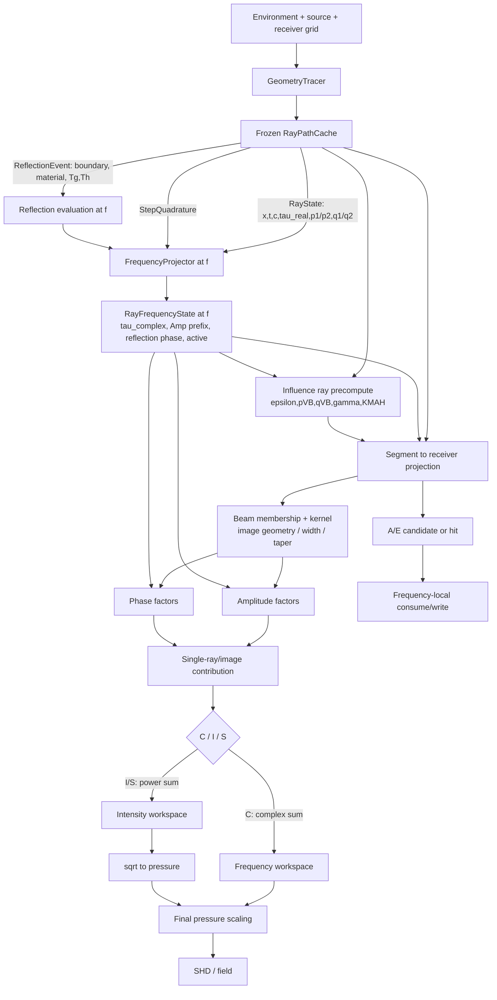

# RayReuse / Bellhop_F2CPP Influence 频率复用审计

> **HISTORICAL / SUPERSEDED (PARTIAL) — 2026-09-01。** 本报告保留 2026-08-25 的源码与性能审计证据，但**不再是当前 IGR implementation roadmap**。以下架构结论已被 [`REPORT_IGR0_REVISION_CROSS_FREQUENCY_FUSION_2026-09-01.md`](./REPORT_IGR0_REVISION_CROSS_FREQUENCY_FUSION_2026-09-01.md) 取代：Executive Summary 中 persistent stencil/cache 推荐；§7 的 persistent geometry cache 建议；§15/§15.1 的 `InfluenceGeometryCache` 与逐频 replay；§15.3 的 `solveFrequencyFromCache()` 集成点；§16 Step 1 的 stencil builder/replay 原型；以及 Audit Verdict 中把 stable geometry identity 作为下一实施路径的部分。当前唯一方向是 **Cross-Frequency Influence Geometry Fusion（transient reuse via loop restructuring）**；persistent geometry structures 仅为 future candidates，full receiver-depth/image materialization 继续 REJECTED。

> 审计基线：`8300c89 feat(rayreuse): close RR-B4 feature sync`
> 审计日期：2026-08-25
> 性质：架构、数据流、公式和性能证据审计；不修改数值路径，不提出测试基线变更。
> 历史范围说明：本文的“当前生产支持面”仅描述上述审计基线；FP-1A～FP-2A
> 已随后补齐多项 TL family 及 ray-centered GeoHat `Ag/ag/Eg`。当前支持范围以
> `REFERENCE_FEATURE_SUPPORT_MATRIX.md` 和 production parity report 为准。

## 1. Executive Summary

### 1.1 核心结论

> **Section status — SUPERSEDED (PARTIAL).** 下列测量、当前数据流和频率局部物理分类仍是历史证据；第 6、10 项把 persistent geometry cache / stable geometry identity 作为首要下一路线的结论已被 cross-frequency fusion 取代。

1. 当前 RayReuse 的 broadband reuse 只跨频率复用了 `RayPathCache`：位置、
   slowness、real travel time、dynamic-ray 基解、step quadrature、reflection
   event 及其局部边界几何/材料身份。它**没有**缓存 Influence 的
   segment→receiver traversal、projection stencil、receiver depth/image
   geometry 或 beam membership。
2. 每个频率仍逐 ray 执行 `FrequencyProjector::project()`，重建 complex travel
   time、累计 reflection amplitude/phase 和 active prefix；随后逐 ray 完整执行
   Influence。当前 serial reuse 的循环是
   `frequency × ray × segment × crossed range × receiver depth × image`。
3. 实际支持范围比“RayReuse 已支持 C/I/S 与全部 beam family”的概括更窄：
   当前 RayReuse TL 生产入口只接受 coherent Cartesian Cerveny `CC`；Cartesian
   `G/B` 用于 A/a/E；I/S、ray-centered `g/R`、GeoHat/GeoGaussian TL 和 simple
   Gaussian TL 属于 F2CPP/Origin 设计面，不是当前 RayReuse TL 路径。
4. 已有 profile 足以确定 pipeline 级热点。16 频 Munk 中 nonreuse 的 Trace /
   Project / Influence 为 `6.114 / 0.504 / 279.429 s`；reuse 为
   `0.405 / 0.509 / 279.211 s`。只消除重复 Trace 的 Amdahl 上限为 `1.020×`。
   64 频 stress 中 Influence 为 `621.719 s`，占 solver wall 的 `99.19%`。
5. 更细的 2 频 profile 记录了约 `5.0 M` range、`1.0 B` receiver-depth、
   `3.0 B` image evaluations，且 `18.438 s` 位于 hot loop，ray precompute 只有
   `0.143 s`。约 `86.4%` image evaluations 在 window 或 taper 阶段被拒绝。
   因而最大实际热点是 receiver-depth/image traversal、筛选、幸存贡献的复指数
   与累加组成的最内层循环；不是 reflection coefficient 或 attenuation projector。
6. 第一条优化路径应是 **Influence Geometry Reuse**：缓存/索引
   segment→range stencil、投影权重和频率无关几何，并以稀疏 receiver interval
   避免全深度扫描。不能缓存完整 segment×receiver×image 表；其内存将达到数十
   GiB。
7. 第二条研究路径应是 **Selective Frequency Reconstruction**，但只对从
   `exp(-iωτ)` 中剥离后的慢变量做 FI-0：reflection 的 `log|R_j|` 与连续相位、
   attenuation action、稳定拓扑内的 Gaussian width/kernel，以及 Cerveny
   transverse residual factor。传播相位 `exp(-iωτ_real)` 必须按目标频率精确重建。
8. `p/q/gamma/epsilon` 虽可随频率变化，但当前计算只占 precompute 小头；它们
   更适合用 frozen dynamic bases 精确、廉价地逐频组合，而不是插值。
9. reflection 插值若进入实验，应以**单次 event** 为单位，分开处理
   `log|R_j|` 与 unwrapped residual phase，再精确做 prefix scan；不应直接插值
   cumulative complex `R`。critical angle、elastic P/S 根分支、零点、抑制阈值
   和相位跳变必须切段或 fallback exact。
10. 新方向不宜命名为简单的 “Influence Frequency Interpolation”。更准确的研究
    定义是 **Influence Factorization + Geometry Reuse + Selective Frequency
    Reconstruction**，并继续嵌入现有 frozen trajectory → projector → Influence →
    accumulation pipeline，而不是建立第二套 solver。

### 1.2 已验证事实、推断与待实验项

- **已验证事实**：下文代码位置、公式执行顺序、支持范围、循环层级、现有 profile
  数字及当前缓存内容。
- **由代码和计数推断**：receiver traversal/image screening 是 pipeline 级主因；
  geometry reuse 有足够大的潜在工作量，但实际可取得多少 wall-time 收益仍需原型
  profile。
- **待 FI-0 验证**：慢变量在具体频带上的平滑性、插值阶数、reference frequency
  密度，以及在临界/焦散/阴影边界处的 fallback 规则。

## 2. Current Influence Architecture

### 2.1 当前生产支持面

| 实现 | TL accumulation | Beam / coordinate | A/a/E | 本审计中的角色 |
|---|---|---|---|---|
| Origin 2-D | C/I/S | Cartesian/ray-centered Cerveny；Cartesian/ray-centered GeoHat；Cartesian GeoGaussian；simple Gaussian | G/g/B | 公式和 observable-order oracle |
| Bellhop_F2CPP | C/I/S | 与本项目已复刻的 Origin 2-D 路径一致；simple Gaussian 仅 coherent Cartesian point/rectilinear | G/g/B | 完整单频 C++ 设计面和公式实现 |
| RayReuse | **C only** | **Cartesian Cerveny `CC` TL only** | Cartesian `G/B` | 当前 broadband 生产实现与性能审计对象 |

RayReuse parser 的实际限制见
[`environment_parser.cpp`](../../src/io/environment_parser.cpp)：`CC` 才能进入 TL；
`AG/aG/AB/aB/EG/EB` 进入 arrival/eigenray；line source、irregular receiver 和
ray-centered `g` 明确拒绝。冻结支持表也将 I/S 和未列出的 beam/coherence 组合
列为 deferred（[`REFERENCE_FEATURE_SUPPORT_MATRIX.md`](../reference/REFERENCE_FEATURE_SUPPORT_MATRIX.md)）。

### 2.2 生命周期与所有权

| 生命周期 | 当前所有者 | 代表数据 | 是否跨频共享 |
|---|---|---|---|
| environment | `SimulationCase` / `Environment` | SSP raw nodes、boundary model、receiver grid | 是，只读 |
| frozen trajectory | `RayPathCache` | `RayState`、`StepQuadrature`、`ReflectionEvent` | 是，当前 reuse 的核心 |
| frequency-local ray state | `RayFrequencyState` | complex `tau`、amplitude、reflection phase、active | 否，每频每 ray 新建 |
| Influence ray precompute | Influence 栈上临时 vectors | combined `p/q/gamma/KMAH` | 否，每频每 ray 新建 |
| receiver projection | Influence 局部标量 | range interval、`W`、`n/Δz`、interpolated state | 否，每频重算 |
| output accumulation | frequency workspace | complex pressure 或 intensity | 否，每频独立 |
| A/E consume | solver consumer/writer | `ArrivalWorkspace`、hit list、ray prefix | 否，每频独立 |

关键结构定义在 [`ray_path.hpp`](../../include/rayreuse/ray/ray_path.hpp) 和
[`frequency_workspace.hpp`](../../include/rayreuse/field/frequency_workspace.hpp)。
当前 `RayPathCache::freeze()` 只验证并冻结 path；没有 Influence geometry cache。

### 2.3 当前调用链

RayReuse TL 的实际调用链为：

```text
Serial/ParallelRayReuseSolver
  -> SingleFrequencySolver::solveFrequencyFromCache(f)
     -> pickMinimumWidthEpsilon(f)
     -> for each frozen RayPath
        -> FrequencyProjector::project(path, f, sourceAmplitude)
        -> CartesianCervenyInfluence::accumulatePrevalidated(...)
     -> scaleCoherentCartesianPointPressure(...)
```

入口见 [`single_frequency_solver.cpp`](../../src/solver/single_frequency_solver.cpp)，
serial 模式按频率调用该入口；parallel 模式将同一调用分配给 frequency workers。
并行改变外层调度，不改变每个 frequency task 内 Project/Influence 的工作。

F2CPP 在同一位置先根据 run type 选择 complex-pressure 或 intensity workspace，
根据 beam family 分派 GeoHat、GeoGaussian、simple Gaussian、Cartesian Cerveny 或
ray-centered Cerveny，再统一 scale。该路径见
[`Bellhop_F2CPP/src/solver/single_frequency_solver.cpp`](../../../Bellhop_F2CPP/src/solver/single_frequency_solver.cpp)。

## 3. End-to-End Data Flow



### 3.1 逐阶段数据表

| 阶段 | 输入 | 输出 | 主要函数 / 文件 | 循环位置 | 下游依赖 |
|---|---|---|---|---|---|
| Trace | real SSP、boundary geometry、source、launch angle | `RayPath` | `GeometryTracer::trace()`；[`geometry_tracer.cpp`](../../src/ray/geometry_tracer.cpp) | source×ray×step；reuse 时只做一次 | 全部 geometry、real `tau`、dynamic bases、reflection events |
| Freeze | paths、steps、events | immutable `RayPathCache` | `RayPathCache::freeze()` | trace 后一次 | Project、Influence、A/E |
| frequency SSP | raw SSP + `f` | real/imag sound-speed evaluator | `CLinearFrequencySsp` / F2CPP `makeFrequencySsp` | frequency scope；evaluate 位于 edge loop | complex travel time、water sample at reflection |
| reflection state | frozen event + boundary + water sample + `f` | one-event `|R|, arg R, suppressed`，更新 prefix | `evaluateBoundaryAcoustics()`；[`boundary_acoustics.cpp`](../../src/acoustics/boundary_acoustics.cpp) | frequency×ray×reflection | amplitude、reflection phase、active |
| attenuation state | frozen quadrature + frequency SSP | complex `tau` prefix | `FrequencyProjector::project()`；[`frequency_projector.cpp`](../../src/field/frequency_projector.cpp) | frequency×ray×propagation edge | attenuation magnitude、propagation phase |
| source state | source amplitude/pattern；S 还用 `f,z_s,alpha` | initial amplitude | F2CPP solver `semiCoherentProjectedSourceAmplitude()` | frequency×source×ray | whole ray amplitude prefix |
| dynamic ray combination | frozen `p1,p2,q1,q2,c,t` + epsilon | `pVB,qVB,gamma,KMAH` | `precomputeRayValues()`；Cartesian / ray-centered Cerveny files | frequency×ray×active point | spreading、window、transverse phase、branch |
| segment→range search | frozen endpoint range + receiver ranges；active prefix | eligible segment and range interval | Cartesian `accumulateImpl()` / family-specific traversal | frequency×ray×segment×crossed range | receiver projection |
| receiver projection | endpoints + receiver coordinate | `W`, projected position/slowness/c/q/tau/gamma；Geo paths also `n` | family Influence implementation | range×depth or depth×image×segment×range | membership、kernel、delay |
| beam/image geometry | receiver depth、surface/bottom depth、normal/delta | image kind/polarity、`n` or `Δz`、candidate mask | `evaluateImageContribution()` 等 | 最内层 depth×image | beam window、taper、phase |
| beam kernel | geometry + `f/epsilon/gamma` | Hat/Hermite/Gaussian weight | family Influence implementation | 最内层 | amplitude/acceptance |
| amplitude construction | source、prefix `Amp`、spreading、kernel、attenuation | real/complex amplitude factor | family Influence implementation | 最内层幸存 candidate | single contribution |
| phase construction | exact real `tau`、transverse delay、reflection/KMAH/image phase、`ω` | phase argument / exponential | `negativeImaginaryExponential()` | 最内层幸存 candidate | single contribution |
| C/I/S accumulation | contribution | complex pressure or intensity | family `accumulate*()` | ray/image inner loop | scale |
| final scale | workspace、`dalpha,c0,f,range,source geometry` | final pressure | `pressure_scaling.cpp` | frequency×receiver cell | SHD |
| A/E consume | candidate/hit + frozen ray prefix | ARR/RAY product | `ArrivalSolver` / `EigenraySolver` consumer | frequency 后处理 | output only |

## 4. Per-Beam-Family Analysis

下式中的 `tau` 在代码中是 complex travel time。其 real part 是传播 delay；其
imaginary part 通过 `exp(Im(ω tau))` 形成 attenuation。为避免符号混乱，本节沿用
代码的 `exp[-i(...)]` 表达。

### 4.1 GeoHat（Cartesian `G/^`，ray-centered `g`）

F2CPP 令

```text
q0 = c0 / Dalpha
L  = |q / q0|
W_hat = (L - |n|) / L,    |n| < L
C_hat = source_ratio * sqrt(c_right / |q|) * Amp_right
DeltaU_C = C_hat * W_hat * exp{-i[omega*delay - phi_reflection - phi_caustic]}
```

- `q` 使用 frozen real `dynamicQ[0]`，所以 `q0/L/n/W_hat` 严格与频率无关。
- Cartesian path 从 ray chord 构造 tangent/normal，对每个 receiver 计算沿线投影
  `W` 和 normal distance `n`；ray-centered path 先把 ray-point normal 投到某一
  receiver-depth 水平线，再用 projected range 跨越 receiver ranges。
- `q` 过零时累计 `pi/2` caustic phase；这是拓扑量，不应连续插值。
- C 模式形成复贡献。I/S 中代码先把 attenuation 放入实常数并平方，再只乘一次
  `W_hat`，不是 `W_hat^2`：

```text
DeltaI_G = [C_hat * exp(Im(omega*delay))]^2 * W_hat
```

- 当前 RayReuse 的 GeoHat 只用于 A/a/E。Arrival 保存 amplitude、phase、delay、
  declination 和 bounce counts；Eigenray 只保存 hit 与 frozen ray prefix。RayReuse
  GeoHat 文件中的 `omega` 在 arrival path 实际未参与 contribution 计算。

F2CPP 公式位置：
[`geometric_hat_influence.cpp`](../../../Bellhop_F2CPP/src/field/geometric_hat_influence.cpp)。

### 4.2 GeoGaussian / Gaussian（Cartesian `B`）

F2CPP/RayReuse Cartesian GeoGaussian 使用：

```text
sigma_g      = |q / q0|
sigma_nf     = 0.2f * f * Re(tau_right)      # 0.2 is legacy REAL4
sigma_lambda = pi * c_left / f
sigma_1      = max(sigma_g, min(sigma_nf, sigma_lambda))
W_G = sqrt(sigma_g / sigma_1) * exp[-0.5 * (n/sigma_1)^2]
C_G = source_ratio * sqrt(c_right / (q0*sigma_1)) * Amp_right
DeltaU_C = C_G * W_G * exp{-i[omega*delay - phi_reflection - phi_caustic]}
```

关键点：

- `sigma_g` 是 G；`sigma_nf` 随 `f` 增大，`sigma_lambda` 随 `1/f` 减小。
- `sigma_1` 的 `max/min` 分支是离散 topology。分支内可能平滑，分支切换处一阶
  导数可不连续。
- segment depth envelope 和局部 membership 都依赖 `4*sigma`，因此候选 receiver
  集合可随频率变化。不能把一个 reference frequency 的 accepted list 当作全部
  频率的 exact list；只能缓存 geometry superset 或精确逐频重做 membership。
- I/S 的代码语义为：

```text
DeltaI_B = sqrt(2*pi) * [C_G * exp(Im(omega*delay))]^2 * W_G
```

  同样不是 coherent complex contribution 的简单 `abs^2`，应保留 Origin 顺序。
- 当前 RayReuse `B` 只用于 A/a/E；没有 GeoGaussian TL 生产入口。

公式和 width branch 见
[`geometric_gaussian_influence.cpp`](../../../Bellhop_F2CPP/src/field/geometric_gaussian_influence.cpp)。

### 4.3 Cerveny Cartesian（`C`）

对每个 ray point：

```text
pVB = p1 + epsilon*p2
qVB = q1 + epsilon*q2
gamma = 0.5 * [ (pVB/qVB)*Tr^2
                + 2*cN/c^2*Tz*Tr
                - cS/c^2*Tz^2 ]
```

对 segment 与 receiver range 的交点插值 `x,t,c,q,tau,gamma`。每个 receiver
depth 和 true/surface/bottom image 令 `delta` 为对应 vertical offset：

```text
window = -omega * Im(gamma) * delta^2 < BeamWindow^2
H = Hermite(delta, Rmax, 2*Rmax),  Rmax = 30*c0/f
C0 = source_ratio * sqrt(c*|epsilon|/q),  then KMAH sign correction
Bi = polarity_i * Amp_right * H
     * exp{-i[omega*(tau + t_z*delta + gamma*delta^2) - phi_reflection]}
DeltaU_C = C0 * sum_i Bi
DeltaI_I/S = |C0 * sum_i Bi|^2
```

Cartesian I/S 先在一条 beam 内 coherent 地求 image sum，再 `ABS^2` 后与其他
beam 非相干累加。RayReuse 只执行 C 分支；F2CPP 同一 family 实现 C/I/S。

频率依赖：

- frozen `p1,p2,q1,q2` 是 G；combined `pVB/qVB/gamma` 通过 epsilon 可能随频率
  变化。RayReuse 只有 minimum-width epsilon，代数上接近 `i*c0*rLoop`，但代码为
  保持 Origin last-bit 顺序仍通过 `sqrt`、square 和 `omega` 逐频构造，不能未经
  证明就按位复用。
- `Rmax`、window metric、transverse phase、complex `tau`、reflection prefix 是 F。
- KMAH 取决于 combined `q` 的 branch crossing；对 frequency-dependent epsilon
  是 T，不能普通插值。

RayReuse 当前实现见
[`cartesian_cerveny_influence.cpp`](../../src/field/cartesian_cerveny_influence.cpp)；
Origin 公式见
[`influence.f90`](../../../Bellhop_origin/Bellhop/influence.f90)。

### 4.4 Cerveny ray-centered（`R` coordinate path）

F2CPP 中：

```text
pVB = p1 + epsilon*p2
qVB = q1 + epsilon*q2
gamma = pVB/qVB
normal = rotate(c*t)
window = -0.5*omega*Im(gamma)*n^2 < BeamWindow^2
DeltaU = source_ratio * Amp_right * sqrt(c*|epsilon|/q)
         * exp{-i[omega*(tau + 0.5*gamma*n^2) - phi_reflection]}
```

随后应用 pressure/V/H component derivative、KMAH sign、surface-image polarity 和
Hermite taper。I/S 对每个 image 的 `|contribution|^2` 乘一次 taper 后累加；它不
采用 Cartesian 路径的 image-coherent-then-square 语义。

ray-centered projection 的循环顺序是 receiver depth → image → ray point →
projected receiver ranges。它还保留 Origin 的 image-normal whole-array persistent
flip 行为，因此 future cache 必须保存/复现 image kind 和遍历拓扑，不能用“更
直观”的局部镜像公式替代。

实现见
[`ray_centered_cerveny_influence.cpp`](../../../Bellhop_F2CPP/src/field/ray_centered_cerveny_influence.cpp)。
该路径当前不在 RayReuse 生产范围。

### 4.5 Simple Gaussian（`S` beam family）

F2CPP 的 Bucker simple Gaussian 仅 coherent Cartesian point/rectilinear：

```text
A  = -4*log(0.98f)/Dalpha^2
CN = Dalpha*sqrt(A/pi)
theta = atan(CPA/effectiveDistance)
DeltaU = sqrt(cos(alpha))*CN*Amp_right/sqrt(effectiveDistance)
         * exp[-A*theta^2]
         * exp{-i[omega*delay - phi_reflection - phi_caustic]}
```

几何距离和 angular kernel 是 G；frequency-local 部分主要是 projected complex
delay、reflection prefix 和 `omega`。实现见
[`simple_gaussian_influence.cpp`](../../../Bellhop_F2CPP/src/field/simple_gaussian_influence.cpp)。
该路径当前不在 RayReuse。

### 4.6 Family 差异摘要

| Family | receiver coordinate | spreading / kernel | membership 随频率 | 主要频率慢变量 |
|---|---|---|---|---|
| GeoHat | Cartesian 或 ray-centered | real `q`, compact linear hat | 否（active prefix 除外） | reflection/attenuation；大部分 Influence 可 exact geometry reuse |
| GeoGaussian | Cartesian | branch-selected `sigma_1` + Gaussian | **是** | width branch、log kernel、reflection/attenuation |
| Cerveny Cartesian | vertical image offset | complex `q/gamma`, Hermite, 1–3 images | **是** | transverse beam action、reflection/attenuation；KMAH topology |
| Cerveny ray-centered | ray normal projection | complex `q/gamma`, Hermite, images | **是** | 同上，且 projection topology 更复杂 |
| Simple Gaussian | Cartesian chord/CPA | angular Gaussian | kernel geometry本身否 | reflection/attenuation；传播 phase exact |

## 5. Reflection Pipeline

```mermaid
flowchart LR
    H[Boundary hit during Trace] --> F[ReflectionEvent frozen]
    F --> G1[boundary id / segment / curvature]
    F --> G2[position / tangent / normal / incident and reflected slowness]
    F --> G3[Tg / Th and optional local LL material]
    G1 --> P[FrequencyProjector at f]
    G2 --> P
    G3 --> P
    P --> R[evaluate R_j(f,theta_j)]
    R --> M[Amp *= |R_j|]
    R --> PH[phase += arg R_j]
    M --> A[active threshold]
    PH --> S[RayFrequencyState prefix]
    A --> S
    S --> I[Influence uses right-point Amp and reflection phase]
```

### 5.1 冻结内容与 incidence angle

`reflectAtBoundary()` 在 trace 时冻结 boundary tangent/outward normal、incident
和 reflected slowness，以及

```text
Tg = dot(incidentSlowness, boundaryTangent)
Th = dot(incidentSlowness, outwardNormal)
theta = folded atan2(Th, Tg)
```

所以在当前“beam shift 禁用、trajectory frequency-independent”的契约下，
incidence/grazing angle 已完全由 frozen trajectory 决定。真实字段见
[`flat_boundary_reflection.cpp`](../../src/ray/flat_boundary_reflection.cpp) 和
[`ray_path.hpp`](../../include/rayreuse/ray/ray_path.hpp)。

动态 ray 的 curvature jump 也在 trace 时写入 reflected `dynamicP`，`dynamicQ`
保持相应 Origin 语义；它不是 projector 中的 frequency-local reflection physics。

### 5.2 每个边界模型的处理

| 输入 BC | 当前 C++ kind | `R` 的生成 | 频率依赖结论 | 推荐处理 |
|---|---|---|---|---|
| V | Vacuum | `R=-1` | 无 | exact reuse；phase `pi` |
| R | Rigid | `R=+1` | 无 | exact reuse |
| F | TabulatedReflection | 对 frozen angle 在 magnitude/unwrapped-phase table 内插 | table 无 frequency axis，故无 | 按 event exact reuse；table 域外的 zero 是离散状态 |
| G | GrainSizeHalfSpace | 由 local water `c` 构造 effective fluid material，loss-parameter half-space | 对当前公式，所有 wavenumber 同阶缩放，系数对 f 不变 | 可在确认 bitwise 后 exact reuse；FI-0 只作验证 |
| A, fluid | AcousticHalfSpace, `cs=0` | complex vertical root 与 impedance ratio | 取决于 attenuation unit / volume model；不总是依赖，也不总是不依赖 | 默认 exact per-frequency；可按模型声明 invariant fast path |
| A, elastic | AcousticHalfSpace, `cs>0` | P/S vertical roots、shear modulus、`y2/y4` | 同上；critical/root branch 风险更高 | exact per-frequency；仅分段 FI-0 |
| elastic LL | A + frozen long material | event 冻结命中 segment 的 full local material 与 attenuation depth | 与对应 fluid/elastic A 相同 | material identity exact reuse，coefficient 默认逐频 |

对于 A：若 attenuation 是 dB/wavelength、Q、loss parameter 或线性 dB/(m·kHz)，
converted imaginary sound speed 可成为 frequency-invariant，且无额外 volume term 时
`R` 常在代数上对频率消去；Np/m、dB/m、power law、Thorp、Francois-Garrison 和
biological 则可保留真实频率依赖。不能只按 BC 字符判断。

F2CPP 将 global volume attenuation 和 frozen LL attenuation evaluation depth 传入
half-space conversion；RayReuse 当前 projector 保存 LL depth，但其现有 half-space
API 不消费该 depth。对当前已支持、已验证的 LL raw attenuation 输入不改变结果，
但未来若同步 depth-dependent volume model，必须把它纳入 frequency-local state，
不能误判为 geometry-only。

### 5.3 amplitude、phase、prefix 与 active

`FrequencyProjector::project()` 按 ray edge 顺序处理 reflection：

```text
Amp_next   = Amp_current * amplitudeMultiplier
Phase_next = Phase_current + phaseIncrement
active_next = active_current && !(Amp_next < 0.005f)
```

half-space raw `|R| < 1e-5f` 时，`classifyBoundaryCoefficient()` 将 amplitude
multiplier 和 phase increment 都置零，并标记 suppressed。每个频率都从 source
重新扫描所有 event，因此 **RayReuse 已经逐频重建 reflection amplitude/phase
prefix 和 active prefix**。当前没有保存独立的 `R_j(f)` 数组，也没有保存
cumulative complex R；只有每个 ray point 的累计 real amplitude 与累计 phase。

### 5.4 插值层级判断

优先顺序：

1. **最佳实验单位：single-event `log|R_j(f)|` + continuous phase
   `phi_j(f)`**。event identity、angle、material 都稳定；可在 event 级检测临界、
   零点和异常 curvature，再做 exact prefix scan。
2. raw complex `R_j(f)` 可保留复平面轨迹，但普通 real/imag 线性插值可能穿过
   错误零点，且很难约束 passivity/phase branch，不是首选。
3. cumulative `R(f)` 会把多个 event 的 phase wrapping、零点和误差耦合；虽然
   查询少，但最难诊断和保持物理一致性，不建议作为首个对象。
4. 单独 interpolation `|R_j|` 比 `log|R_j|` 更难控制相对误差；在接近零时两者
   都必须进入 guarded exact/zero handling，`log` 不能跨零。

实际性能上 Project 在 16 频 profile 仅约 `0.5 s`，所以 reflection FI 是物理
可行性研究项，不是当前第一加速来源。

### 5.5 Reflection 插值风险区

- **critical angle / grazing**：vertical root 从 propagating 转 evanescent，phase
  曲率会陡增；必须检测距离临界点的 margin。
- **elastic P/S conversion**：P、S 各有 root branch；两种临界条件和耦合项会
  产生快速变化。当前实现求的是 fluid incident pressure reflection coefficient，
  P/S conversion 的影响已隐含在 `y2/y4`，不是两个可独立随意插值的权重。
- **reflection zero / denominator near zero**：`log|R|` 奇异、phase 不可定义；
  raw complex interpolation也可能跨错零点。
- **phase jump / unwrap**：`atan2` 输出 wrapped phase；unwrap 必须按 event、按
  连续 frequency segment 进行，且在 magnitude floor 以下停止延续。
- **small-coefficient suppression 与 active threshold**：`1e-5f` 和 `0.005f` 是
  离散状态，必须逐频精确判断或 exact fallback，不能插值布尔值。
- **tabulated F**：它是在 angle 维内插，不是 frequency interpolation；当前
  frozen angle 下应直接 reuse 结果。表域边界的 zero 也应保持离散语义。
- **beam shift**：Origin 可使 position/tau/q 受 reflection physics 影响；当前
  RayReuse 明确不支持。未来若启用，它会破坏 frozen trajectory 契约，不能纳入
  本方案的普通 factor interpolation。

## 6. Attenuation Pipeline

### 6.1 当前数据流

```text
RawAttenuation + volume model + f + local c/depth
  -> alpha(f,z) [Np/m]
  -> imaginary sound speed c_i(f,z)
  -> frozen step quadrature integrates 1/(c + i*c_i)
  -> complexTravelTime prefix tau_c(f,s)
  -> Influence exp{-i*omega*tau_c}
  -> magnitude exp[omega*Im(tau_c)]
```

因此需要区分三个层级：

1. `alpha(f,z)`：局部 material/volume attenuation；路径之外仍依赖频率和可能的
   depth。
2. `A_att(f,s)` 或 complex-slowness integral：沿 frozen quadrature 的累计量。
   当前代码实际保存 `Im(tau_c)`，没有显式命名的 `integral alpha ds` 数组。
3. `exp[-A_att]`：在 Influence 的 complex exponential 中最终形成的 magnitude。

RayReuse **没有**在 trace 时积分 attenuation。它冻结了 step start/midpoint weights
和 midpoint；lossless SSP 直接复用 frozen real travel time，uniform complex SSP
用 frozen weights 快速积分，一般 SSP 则每频 evaluate start/midpoint/end 并更新
complex travel time。见
[`frequency_projector.cpp`](../../src/field/frequency_projector.cpp)。

F2CPP 的 attenuation unit/volume model 比当前 RayReuse 更完整，包括 Thorp、
Francois-Garrison 和 biological；RayReuse 当前只真正实现 None/Thorp，其他 enum
分支会抛出 unsupported。该差异必须以实际代码为准，不能把 F2CPP 全集视为
RayReuse 已有能力。

### 6.2 分类与插值判断

- frozen path length、quadrature weights、midpoints 和 real `tau`：G，exact reuse。
- `alpha(f,z)`、imaginary sound speed、complex-slowness integral：F；计算位于
  Project，不在最热 receiver loop。
- 若做 FI-0，最合理的对象是 additive 的
  `A_att(f,s) = -omega*Im(tau_c(f,s))` 或 `Im(tau_c)` prefix，而不是最终指数。
  additive/log-domain 表示能保持非负 attenuation、便于 error budget，并避免
  exponent 下溢掩盖误差。
- 但现有计时显示全部 Project 都远小于 Influence，故 attenuation 默认应继续
  exact per-frequency。只有当 future factor reconstruction 能连同 receiver-side
  residual factor 一起跳过大量 exact evaluations 时，它才值得成为插值组成项。

## 7. Receiver Projection / Geometry Reuse

> **Section status — SUPERSEDED (PARTIAL).** 纯几何/频率局部分类继续有效；缓存粒度建议不再是 IGR-1 roadmap。v1 以 transient fused traversal 复用这些几何量，不构建 persistent stencil/depth index。

### 7.1 当前是否逐频重做

| 操作 | 严格频率无关 | RayReuse 当前缓存 | 建议粒度 | 备注 |
|---|---|---|---|---|
| segment endpoints / direction | 是 | frozen path only | ray/segment | exact reuse |
| segment→receiver range search | 是；但 active suffix 随 f | 否 | segment→range sparse stencil + exact active mask | 当前 CC 每频重做 upper-index 和 interval |
| receiver range index / interpolation `W` | 是 | 否 | one record per crossed range | 最直接的 cache 项 |
| interpolated position/slowness/real c | 是 | 否 | range stencil；按收益选择存值或存 `W` | 当前每频重算 |
| real `tau` interpolation | 是 | 否 | range stencil 或由 endpoint+W 重建 | 传播 phase exact reconstruction 的基础 |
| complex `tau` interpolation | 否 | 否 | exact per-frequency | attenuation component随 f |
| Cartesian image `Delta z` / polarity | 是 | 否 | geometry formula + image kind；不展开全表 | surface/bottom depth固定 |
| Geo Cartesian `n` / projected `s` | 是 | 否 | segment×receiver candidate | irregular grid需带 receiver identity |
| ray-centered endpoint normal projection | 是 | 否 | depth×point projection或稀疏 crossing | 需保存 Origin image flip topology |
| `q/gamma` interpolation | epsilon可能随 f | 否 | cache bases和`W`，逐频廉价组合 | 不建议插值 |
| beam membership / window | Hat 是；Gaussian/Cerveny 否 | 否 | exact per-frequency；可用 geometry bounds/index | topology，不缓存 reference mask |
| Hermite/Gaussian kernel | Hat W 是；Cerveny/Gaussian有 f | 否 | Hat exact reuse；其余 exact/FI-0 | 计算便宜但调用巨大 |
| irregular receiver lookup | geometry-only | 否 | receiver-id-aware stencil | F2CPP Cartesian family支持程度不同 |

### 7.2 合理缓存层级

> **Historical candidate analysis.** 下列层级只作为 future-candidate 记录；“segment→receiver-range stencil（首选）”已被取代，full pair 拒绝仍有效。

1. **ray/segment metadata**：segment direction、range orientation、duplicate marker、
   caustic topology bases。内存小，但只消除少量 arithmetic。
2. **segment→receiver-range stencil（首选）**：`left/right index, range index, W`
   加可选 interpolated geometry。它把 receiver range search 与 interpolation identity
   固定下来，同时保留 depth/image 在目标频率精确判断。
3. **receiver-depth index structure**：不是缓存全部 pair，而是为有序 depths 构造
   可精确查询的 interval/index；每频由真实 beam width/window 给出 bounds，避免
   无条件扫描所有 depth。
4. **完整 segment×receiver-depth×image cache（拒绝）**：过大，并且 Gaussian/
   Cerveny membership 随频率，难以保持 exact。

profile 的 2 频总量可给出量级估计。若两频 topology 相同，除以二得到约：

- `2.486 M` unique range stencils；每 record `32–64 B` 约 `76–152 MiB`。
- `499.8 M` receiver-depth pairs；即使 `16 B` 也约 `7.45 GiB`。
- `1.499 B` image pairs；即使 `16 B` 也约 `22.3 GiB`。

因此应使用压缩 range stencil + depth index/superset，不应 materialize full pair
table。最终 record layout 必须通过 cache hit、RSS 和 wall profile 决定；上述不是
预先固定 ABI。

### 7.3 irregular receiver、line source、image beam 的影响

- F2CPP Cartesian GeoHat/GeoGaussian 使用 `depthAt(depth, range)`，cache key 必须
  包含真实 receiver cell identity。F2CPP Cartesian Cerveny 为兼容 Origin 的
  observable legacy behavior，在 irregular layout 中对各 range 使用第一 depth；
  cache 必须复现而非“修正”该语义。
- ray-centered Cerveny/GeoHat 当前要求 rectilinear/uniform ranges；未来支持
  irregular 时不能复用 uniform-range index 算法。
- line source 主要改变 source normalization 和 final range scaling，不改变
  segment/receiver geometry；cache metadata 应将 source geometry 作为 compatibility
  key，但不必复制 stencil。
- true/surface/bottom image 的 receiver geometry可由同一 base stencil加 image
  transform 表示；不应展开三份大表。polarity/image kind 是 T。

### 7.4 热点究竟是 physics 还是 geometry traversal

现有证据可以回答到 pipeline 层级：

- frequency-local SSP、reflection、attenuation 全在 Project，16 频总计约
  `0.5 s`；Influence 约 `279 s`。
- Influence 内部 `0.143 s` ray precompute 对比 `18.438 s` hot loop。
- hot loop 的 `3.0 B` image tests 中约 `2.59 B` 被 window/taper 拒绝，只有
  `406.8 M` 形成非零 image contribution。

因此答案主要是 **B：重复 receiver geometry traversal / candidate screening，
加上其触发的幸存贡献计算**。但现有 profile 没有把最内层进一步拆成“纯几何
arithmetic、complex exp、pressure memory update”三个独立时间，所以不能声称某
一条 CPU instruction 已被证明占绝对多数。下一原型应保留这三个子计数/子计时。

## 8. Dynamic Ray / Beam Kernel Analysis

### 8.1 dynamic bases 与 epsilon

`RayState` 已冻结两组 real dynamic-ray bases：`p1,p2,q1,q2`。这是最有价值的
exact reuse，因为任意支持的 epsilon 都可廉价构造：

```text
pVB(f) = p1 + epsilon(f)*p2
qVB(f) = q1 + epsilon(f)*q2
```

F2CPP epsilon modes：

- SpaceFilling：halfwidth `~1/f`，`Im(epsilon) ~1/f`。
- MinimumWidth：halfwidth `~f^-1/2`，epsilon 代数上近似 frequency-invariant，
  但代码为 Origin rounding compatibility 仍逐频计算。
- WKB：real epsilon，取决于 source gradient/angle，通常与 f 无关。

当前 RayReuse 只有 MinimumWidth。`epsilon/pVB/qVB/gamma/KMAH` 每 ray point
precompute 的实测成本很低，因此建议缓存 bases、逐频精确组合；不要为省
`0.143 s` 引入 frequency interpolation 和 branch ambiguity。

### 8.2 kernel 层级

| kernel | G 部分 | F 部分 | T 部分 | 判断 |
|---|---|---|---|---|
| GeoHat | `q/q0,n,L,W_hat` | active/reflection/attenuation | q-zero caustic | 大部分 exact reuse |
| GeoGaussian | `q/q0,n,sigma_g` | `sigma_nf,sigma_lambda,sigma_1,W` | width branch、membership、caustic | 稳定分支内可 FI-0 |
| Cerveny | dynamic bases、receiver geometry | epsilon combination、complex q/gamma、window、Rmax、transverse action | KMAH、membership、image kind | exact cheap algebra + selective residual FI |
| Simple Gaussian | CPA/effective distance/angular offset、A/CN | omega/reflection/attenuation | caustic | 几何 exact reuse |

值得实验的 Cerveny 插值对象不是 raw `gamma` 本身，而是在固定 geometry stencil
上、去掉 `omega*tau_real` 后的 residual beam factor：

```text
Fslow(f) = spreading(f) * kernel(f)
           * exp[-A_att(f)]
           * exp{-i[psi_transverse(f) - phi_reflection(f)]}
```

它可能避免大量幸存 candidate 的 complex sqrt/exp，但只有在 membership、KMAH
和 image topology 未改变的 frequency interval 内才有定义。FI-0 必须同时记录
factor 与 topology id。

## 9. Phase Decomposition

对固定 ray/segment/receiver/image，可写成：

```text
Phi_total(f) = omega(f) * tau_real
             + psi_transverse(f)
             - phi_reflection(f)
             - phi_caustic_or_KMAH
             - phi_image/source
```

代码中的实际符号由 `exp{-i[omega*(...) - reflectionPhase]}` 给出。

| phase 部分 | 来源 | 处理 |
|---|---|---|
| `omega*tau_real` | frozen ray real travel time + exact receiver interpolation | **目标频率精确恢复；绝不插值 phasor** |
| attenuation imaginary action | complex `tau` imaginary part | exact per-frequency；FI-0 可测试 additive/log representation |
| Cartesian Cerveny linear transverse | `omega*t_z*Delta z` | geometry已知，按目标 f exact |
| Cerveny quadratic transverse | Cartesian `omega*gamma*Delta z^2`；ray-centered `0.5*omega*gamma*n^2` | gamma exact cheap；可测试 residual phase reconstruction，但不插值高速总 phasor |
| reflection phase | cumulative `arg R_j(f)` | invariant BC exact reuse；A/elastic逐频或分 event FI-0 |
| Geo caustic phase | real q zero crossing `+pi/2` | T，exact reuse/discrete handling |
| Cerveny KMAH | complex q branch crossing/sign | T，逐频 exact handling |
| image polarity | surface `-1` 等 | T，explicit sign |
| S Lloyd mirror | `sqrt(2)|sin(omega z_s sin(alpha)/c0)|` | amplitude，不是 phase；cheap exact per-frequency |
| source pattern | launch-angle table | geometry/source-local，当前 frequency-independent | exact reuse |

直接插值 final complex pressure 或 single-ray rotating phasor会要求 reference spacing
解析最大的 `tau`，否则相位 aliasing；这正是本研究应避免的问题。先剥离已知
`omega*tau_real`，再评估 slow residual 的 curvature。

## 10. C / I / S Differences

### 10.1 Coherent C

- single image/ray contribution 在 family Influence 最内层形成。
- 同一 beam 的 image 是否先 coherent sum 取决于 family：Cartesian Cerveny 先
  sum images；ray-centered Cerveny逐 image 直接写入；Geo family 每个 crossing
  形成一个 complex increment。
- 不同 ray 的 complex contribution 直接加到 `FrequencyWorkspace`。
- final scale 仍保留 complex phase。

### 10.2 Incoherent I

- 使用 `IntensityWorkspace`。
- Cartesian Cerveny：`abs(const * sumImages)^2`，ABS² 位于 beam 内 image coherent
  sum 之后。
- ray-centered Cerveny：每 image `abs(contribution)^2 * taper`。
- GeoHat/GeoGaussian：使用 Origin `ApplyContribution` 的专门实数公式；Hat/Gauss
  weight只乘一次。
- 不同 beam 之间累加 intensity；最终 `sqrt(intensity)` 转成 real pressure。

### 10.3 Semicoherent S

Influence accumulation 与 I 共用 intensity 分支。S 的额外差异在 Project 前的
source amplitude：

```text
A_source,S = A_base * sqrt(2) * |sin[(omega/c0)*z_source*sin(alpha)]|
```

即 Lloyd mirror factor 每频每 ray 廉价精确计算。它可产生 source null，是离散
active/relative-error 风险区，不值得插值。

### 10.4 三者共享与插值边界

- 共享：frozen geometry、projection stencil、reflection/attenuation prefix、beam
  dynamic state 和 membership semantics。
- 可共享的 FI-0 candidate：event reflection factors、attenuation action、稳定
  topology 内的 beam slow factor。
- 不共享的输出语义：C 是 complex sum；I/S 在不同 family 的 ABS² 位置也不同。
- final accumulated pressure/intensity混合许多具有不同 delays 的 ray，随频率可
  产生密集干涉零点。它是 O，**不应成为首选插值对象**。

当前 RayReuse 没有 I/S TL 生产入口；以上结论来自 F2CPP/Origin，用于确保 future
architecture 不把 C-only 假设固化进 factor schema。

## 11. Variable Classification Matrix

标签：G = Geometry reusable；F = Frequency-local cheap；I = Interpolation
candidate；T = Topological/discrete；O = Output/accumulation only。

“Proposed treatment” 严格使用约定集合。`Cost` 是相对当前 pipeline；对于未单独
计时的 inner operations，明确标为 hot-loop aggregate，而不伪造 instruction
profile。

| Process / Variable | Frequency dependent | Current location | Cost | Smoothness expectation | Classification | Proposed treatment |
|---|---|---|---|---|---|---|
| ray position `x(s)` | no | frozen `RayState` | memory read | exact | G | exact reuse |
| slowness / tangent / normal bases | no | frozen state / Influence recompute normal | low but repeated | exact | G | cached geometry |
| real sound speed `c` on ray | no under frozen-trajectory contract | frozen state | low | exact | G | exact reuse |
| SSP segment identity / point location | no for real path | Project/Influence evaluator | low | exact | G | cached geometry |
| real travel time `tau_real` | no | frozen state | low | exact | G | exact reuse |
| `StepQuadrature` weights/midpoint | no | frozen path | low | exact | G | exact reuse |
| dynamic bases `p1,p2,q1,q2` | no | frozen state | low | exact | G | exact reuse |
| epsilon | yes by beam-width mode | solver per f/ray | negligible | analytic but mode-specific | F | exact per-frequency |
| combined `pVB/qVB` | via epsilon | Cerveny precompute | low; `0.143 s` aggregate precompute | generally smooth except zero | F | exact per-frequency |
| gamma | via epsilon/q and SSP gradient | Cerveny precompute | low | smooth away from q=0 | F | exact per-frequency |
| KMAH / branch cut | possibly via q | Cerveny precompute/projection | low | discrete | T | discrete/topological handling |
| geometric caustic phase | no for real-q Geo path | family segment loop | low | step changes by pi/2 | T | discrete/topological handling |
| ReflectionEvent identity/count | no | frozen path | low | exact/discrete | T | exact reuse |
| incidence angle `theta_j` | no | frozen `Tg/Th` | negligible | exact | G | exact reuse |
| V/R reflection coefficient | no | Project reflection edge | negligible | constant | G | exact reuse |
| F tabulated reflection result | no at frozen angle | Project reflection edge | low | angle table only | G | exact reuse |
| G grain reflection result | algebraically no in current model | Project reflection edge | low | constant | G | needs experiment |
| A fluid single-event `log|R_j(f)|` | model-dependent | Project reflection edge | low | smooth away from critical/zero | I | sparse-frequency + interpolation candidate |
| A fluid single-event phase | model-dependent | Project reflection edge | low | unwrap-able away from critical/zero | I | sparse-frequency + interpolation candidate |
| elastic event R magnitude/phase | often | Project reflection edge | low | may be non-smooth at P/S criticals | I | needs experiment |
| reflection suppression `<1e-5` | yes | boundary classification | negligible | discrete | T | discrete/topological handling |
| cumulative reflection amplitude/phase | yes | `RayFrequencyState` prefix | low | compounds events/wraps | F | exact per-frequency |
| active prefix `<0.005` | yes | Project prefix | low | discrete | T | discrete/topological handling |
| source pattern / directional factor | current table no | solver before Project | negligible | exact | G | exact reuse |
| S Lloyd mirror factor | yes | F2CPP solver before Project | negligible | oscillatory/nulls | F | exact per-frequency |
| local `alpha(f,z)` | yes | frequency SSP / attenuation conversion | low | model-dependent; resonance possible | F | exact per-frequency |
| complex travel-time prefix | yes if lossy | Project propagation edge | low total | generally smooth except resonant model | F | exact per-frequency |
| attenuation action `-omega Im(tau)` | yes | implicit in Influence exponential | low today | smooth for common models; biological can resonate | I | needs experiment |
| segment→receiver range candidates | no, except active suffix | Influence segment loop | high aggregate reuse opportunity | exact | G | cached geometry |
| receiver range stencil / `W` | no | crossed-range loop | high aggregate reuse opportunity | exact | G | cached geometry |
| interpolated position/slowness/real c | no | crossed-range loop | medium aggregate | exact | G | cached geometry |
| receiver projected `s` / normal distance `n` | no | Geo/ray-centered projection | high aggregate | exact | G | cached geometry |
| Cartesian image `Delta z` / polarity | no | depth×image loop | very high call count | exact/discrete | G | cached geometry |
| image kind / mirror topology | no | image loop | very high call count, cheap each | discrete | T | discrete/topological handling |
| GeoHat beam radius / W | no | receiver loop | medium aggregate | exact, compact support boundary | G | cached geometry |
| GeoGaussian `sigma_g` | no | receiver loop | medium aggregate | exact | G | cached geometry |
| GeoGaussian `sigma_nf/sigma_lambda` | yes | segment/receiver loop | medium aggregate | analytic | F | exact per-frequency |
| GeoGaussian width branch | yes | max/min selection | medium aggregate | discrete switch | T | discrete/topological handling |
| GeoGaussian log kernel inside stable branch | yes | receiver loop | high aggregate due exp | smooth inside stable branch | I | sparse-frequency + interpolation candidate |
| Cerveny `Rmax=30c0/f` | yes | Influence per f | negligible | analytic | F | exact per-frequency |
| Hermite taper | Cerveny yes; Hat kernel no | depth/image loop | high aggregate but cheap each | piecewise smooth, support edges | F | exact per-frequency |
| beam window / membership | Gaussian/Cerveny yes | deepest loops | very high aggregate | Boolean/discontinuous | T | discrete/topological handling |
| point/line normalization | yes for Cerveny scale | final scale | negligible | analytic | F | exact per-frequency |
| image-beam/Lloyd factors | model-dependent | source/image loops | low | sign/null topology | T | discrete/topological handling |
| geometric spreading/principal sqrt | Cerveny via q/epsilon；Geo often no | range loop | medium aggregate | smooth away from q=0 | F | exact per-frequency |
| Cerveny transverse residual phase/action | yes | depth/image phase argument | very high aggregate | smooth only within stable q/KMAH/membership | I | sparse-frequency + interpolation candidate |
| `exp(-i*omega*tau_real)` | yes, fast rotation | deepest contribution | high aggregate | analytically known, not sample-smooth | F | exact per-frequency |
| residual complex exponential | yes | deepest contribution | high aggregate | potentially smooth after factorization | I | needs experiment |
| single image/ray contribution | yes | family hot loop | very high aggregate | zeros/topology/interference | O | do not interpolate |
| C complex accumulation | yes | `FrequencyWorkspace` | very high aggregate memory writes | interference-sensitive | O | do not interpolate |
| I/S ABS²/intensity accumulation | yes | family-specific inner loop | high aggregate | family-order-sensitive | O | do not interpolate |
| receiver final pressure/TL | yes | scaled workspace/output | low compute; highly oscillatory value | interference zeros | O | do not interpolate |
| Arrival candidate projection | factors partly f-dependent | G/B Influence | workload-dependent | topology can change | O | do not interpolate |
| Eigenray hit/prefix | active and Gaussian width may vary | G/B Influence + consumer | workload-dependent | discrete | T | discrete/topological handling |

## 12. Performance Hotspot Assessment

### 12.1 静态复杂度

通用上界为：

```text
Nfreq * Nsource * Nrays * Nsegments
      * Nreceiver_candidates_per_segment * Nimages
```

Cartesian Cerveny 当前 range candidate 内还无条件循环全部 receiver depths，所以
可写为：

```text
Nfreq * Nsource * Nrays * Neligible_segments
      * Ncrossed_ranges * Nreceiver_depths * Nimages
```

最内层依次包含 image delta、window、Hermite、phase argument、`exp/cos/sin`、
image sum、principal factor 和 pressure/intensity read-add-write。reflection 与 SSP
projection 不在 receiver loop 内。

### 12.2 已有 benchmark/profile 证据

1. 16 频 Munk、10,000 rays、约 3,367,964 cached points、201×501 receiver cells：
   nonreuse Influence `279.429 s`，reuse `279.211 s`；Project 约 `0.5 s`。来源：
   [`REPORT_OFFICIAL_BENCHMARK_C77FF60_2026-07-30.md`](../archive/benchmarks/REPORT_OFFICIAL_BENCHMARK_C77FF60_2026-07-30.md)。
2. 2 频诊断：`999,564,960` depth、`2,998,694,880` image evaluations，
   `406,782,232` nonzero contributions；precompute/hot-loop
   `0.1427/18.4380 s`。来源：
   [`REPORT_F1_BASELINE_96F23F8_2026-07-30.md`](../archive/benchmarks/REPORT_F1_BASELINE_96F23F8_2026-07-30.md)。
3. 后续安全局部性优化后，16 频 serial reuse Influence 仍为 `86.563 s`；已试的
   endpoint state cache、receiver-depth scalar cache 和 depth tile 分别回退，说明
   小型局部缓存不是 geometry reuse 的充分实现。来源：
   [`REPORT_F2_LOOP_INVARIANTS_7CE9C7D_2026-07-31.md`](../archive/benchmarks/REPORT_F2_LOOP_INVARIANTS_7CE9C7D_2026-07-31.md)。
4. 64 频 stress serial reuse Influence `621.719 s`，占 wall `99.19%`。来源：
   [`REPORT_F2_64_FREQUENCY_MATRIX_FDAAF56_2026-07-31.md`](../archive/benchmarks/REPORT_F2_64_FREQUENCY_MATRIX_FDAAF56_2026-07-31.md)。

### 12.3 Cost ranking

| Rank | 操作 | 依据 |
|---|---|---|
| Very High | receiver-depth/image hot loop 整体 | `18.438 s` vs precompute `0.143 s`；约 3 B image calls |
| Very High | window/taper screening + 幸存 contribution exp/accumulate | 最内层；约 2.59 B reject、406.8 M nonzero |
| High | 每频重复的 segment/range traversal 与全-depth fan-out | 5 M range触发1 B depth；当前无 cache/index |
| Medium | complex sqrt/principal、q/gamma interpolation | crossed-range 层；未单独计时，但远少于 image calls |
| Low | whole-ray p/q/gamma/KMAH precompute、EvaluateSSP for gamma | 已测 precompute `0.143 s` |
| Low | FrequencyProjector 的 SSP/attenuation/reflection | 16 频合计约 `0.5 s` |
| Negligible | epsilon、source factor、final scaling、workspace validation fast path | 计数低或现有阶段时间近零 |

不能从现有 aggregate profile 单独断言 `exp`、Hermite 或 memory store 中哪一条是
最大 instruction hotspot。FI-0/geometry prototype 应增加最少的“membership reject、
nonzero factor evaluation、accumulation”分层时间，而不是再次做无依据微优化。

### 12.4 trajectory-only 性能上限

现有 16 频数据给出：

```text
Smax_trace-only = 286.823 / [286.823 - (6.114 - 0.405)] = 1.020x
```

实测 serial reuse 为 `1.023×`。这说明 trajectory reuse 已正确工作，但只触及约
2% wall。要获得有研究意义的 broadband speedup，必须进一步减少 Influence 的
receiver traversal/image evaluation 或跳过一部分 exact frequency factor
evaluation；只继续优化 Trace、reflection 或 attenuation projector 不可能改变
数量级。

## 13. Interpolation Risk Cases

1. **传播相位 aliasing**：任何含 `omega*tau_real` 的 complex value 都可能在很小
   frequency step 内转多圈；必须先精确剥离。
2. **receiver shadow / beam boundary**：membership 从 0/1 切换，普通插值会制造
   ghost contribution 或漏掉新 contribution。
3. **caustic / q≈0**：spreading 发散、KMAH/caustic phase 改变，magnitude-phase
   表示均不稳定。
4. **Gaussian width branch**：`max/min` 选择改变，kernel 虽连续也可能曲率剧变；
   topology id 必须进入 sample metadata。
5. **critical angle / elastic P-S roots**：reflection magnitude/phase快速变化，root
   branch 可能切换。
6. **reflection zero / pole-like denominator**：log magnitude 和 phase undefined；
   必须 exact/fallback，并设置 magnitude floor。
7. **phase unwrap**：只能对固定 event 或固定 geometry contribution identity 做；
   不得跨 zero、topology change 或不同 image/ray 混合 unwrap。
8. **active prefix threshold**：小 reflection 使后续整个 ray suffix 离散消失；插值
   prefix 会破坏 Origin stop semantics。
9. **S Lloyd null**：source amplitude 有确定性高频 oscillation/null；cheap exact。
10. **coherent cancellation**：final pressure 在 ray interference zero 附近 relative
    error 可任意放大；应同时报告 absolute pressure 和 TL error，不以 final complex
    pressure作为插值对象。

## 14. FI-0 Experimental Plan

### 14.1 研究问题

FI-0 不追求加速，只回答：

> 在固定 frozen trajectory 和固定 receiver geometry identity 下，哪些 Influence
> 中间 factor 在 frequency 维度足够平滑，能在明确 topology guard 和 error budget
> 下稀疏采样？

### 14.2 最小代表 case 集合

避免组合爆炸，建议 6 个高信息量 case：

| ID | 环境/路径 | Beam | 隔离目标 |
|---|---|---|---|
| FI0-D | lossless constant/c-linear，直达、无反射 | GeoHat + Cartesian Cerveny | geometry、known tau、pure transverse factor |
| FI0-V | V surface，多 bounce，rigid/无损 bottom | GeoHat | frequency-invariant reflection、caustic与多次 prefix |
| FI0-AF | lossy fluid A bottom，选 normal 与 near-critical 两条 ray | GeoHat/Cerveny | `log|R|`、reflection phase、attenuation action |
| FI0-AE | elastic LL bottom，覆盖 P/S critical 邻域 | Cerveny | elastic non-smoothness、unwrap/fallback |
| FI0-B | direct + bottom 的 Cartesian GeoGaussian | GeoGaussian | `sigma` branch、membership、log kernel |
| FI0-C | Munk/Cerveny，选择普通、caustic、beam edge、shadow edge receiver | Cartesian Cerveny | residual beam factor 与 topology change |

RayReuse 当前只能直接承载 `CC` TL 与 `G/B` A/E；FI0-D/C 的 production-near
instrumentation 应优先放在 RayReuse CC。其他 family 的 truth 可先用 F2CPP 现有
diagnostic/oracle 设计验证，但本阶段不新增实现。

### 14.3 Frequency truth 与稀疏抽样

- 每个 case 选一个足以触发目标现象但不过宽的 band；全 band 使用 uniform truth
  grid。额外在 critical/branch crossing 周围布置局部 dense truth points。
- 从同一 truth grid 抽 stride `2/4/8/16` 的 references；不改变 trajectory、ray
  identity 或 receiver identity。
- 比较：linear、log-linear magnitude、magnitude + unwrapped phase。对 complex R
  可附加 real/imag linear 作为反例/基线，但不作为默认候选。
- 在 reference 之间用 exact `omega*tau_real` 重建完整 phase；不得从 truth final
  complex pressure直接抽样插值。

### 14.4 Instrumentation points

只设计，不在本任务实现：

1. Project/event：`event_id, theta, raw R, log|R|, wrapped/unwrapped phase,
   suppressed, cumulative Amp/phase, active`。
2. Project/path point：`Re/Im tau, attenuation action, local alpha model id`。
3. geometry stencil：`ray, segment, range, depth, image, W, n/Delta z, real tau,
   topology id`。
4. beam factors：epsilon、q、gamma、KMAH、width branch、window metric、taper、
   log spreading、log kernel、transverse residual phase。
5. assembled diagnostic：exact factor、reconstructed factor、exact-known propagation
   phasor，以及 contribution error；final field只作端到端后验，不作为训练对象。

### 14.5 指标与判据

对每个 scalar/complex factor 输出：

- magnitude、log magnitude、wrapped phase、segmented unwrapped phase；
- absolute/relative error；phase circular error；
- frequency first/second divided difference 或 normalized curvature；
- topology mismatch count、zero/critical fallback count；
- stride 对 exact evaluations saved 的比例。

建议 FI-0 首先用 factor-local 门槛而非预设最终 TL 门槛：稳定 topology 区间内，
interpolated log magnitude 与 residual phase error 随 stride 单调收敛；跨 topology
时 guard 必须 100% 触发 exact/fallback。最终可再报告 complex pressure、TL 和
phase error，验证 local error 是否可传递。

### 14.6 Adaptive sampling 的必要性

固定 stride 是 FI-0 的诊断工具，不应直接成为最终算法。reflection critical、
Gaussian branch 和 caustic/shadow edge 的局部 curvature 差异很大，因此若 FI-0
证明存在平滑区，后续应采用：

```text
endpoint/midpoint exact sample
  -> topology equality check
  -> factor curvature/error estimate
  -> accept interpolation or bisect frequency interval
```

reference frequencies 应由 factor error 和 topology event 选择，而不是只按频带
等距或只选一个中心频率。

## 15. Recommended Architecture

> **Section status — SUPERSEDED.** 下列 `InfluenceGeometryCache → per-frequency replay/reconstruction` 图不是当前架构。替代架构见 2026-09-01 final-remediation report §B：frequency loop 下沉到 ray/segment/receiver traversal，几何即时被多频消费。

建议的整体名称：

> **Influence Factorization + Geometry Reuse + Selective Frequency Reconstruction**

而不是单独的 “Influence Frequency Interpolation”。后者会误导为 final pressure
插值，也掩盖无损 geometry reuse 是独立且先行的优化层。

```mermaid
flowchart TD
    FRC[Frozen RayPathCache] --> IGC[InfluenceGeometryCache<br/>segment-range stencil + receiver index]
    FRC --> EFP[ExactFrequencyProjector]
    RF[Selected reference frequencies] --> EFP
    EFP --> IFE[InfluenceFactorEvaluator]
    IGC --> IFE
    IFE --> RS[Reference slow factors + topology ids]
    TF[All target frequencies] --> SFR[SelectiveFrequencyReconstructor]
    RS --> SFR
    SFR --> GUARD{topology/error guard}
    GUARD -->|accepted| ASM[ContributionAssembler]
    GUARD -->|fallback| EX[Exact factor evaluation]
    EX --> ASM
    FRC -->|exact tau_real| ASM
    ASM -->|exact exp(-i omega tau_real)| ACC[C/I/S accumulation]
    ACC --> OUT[Broadband field]
```

### 15.1 Influence Geometry Reuse（无损）

> **SUPERSEDED (PARTIAL).** Persistent sparse stencil / receiver index 不再是 IGR-1 首选；仅保留为 future candidate。当前方案不 materialize replay records。

- 新状态仍从 `RayPathCache` 派生，不写回 frozen cache。
- 以 ray/segment→range sparse stencil 为第一层；保存 identity、`W` 和必要 geometry。
- receiver depths 使用索引/interval query，按目标频率精确计算 beam bounds，避免
  materialize full pair table。
- cache compatibility key 至少包括 path fingerprint、receiver grid、coordinate
  family、image count 和 Origin-compatibility semantics。
- replay 必须保持每个 receiver cell 的 ray/segment/image accumulation order，
  先追求 bitwise/equivalent exactness。

### 15.2 Influence Frequency Reconstruction（近似）

建议 factor schema 不保存 final complex contribution，而保存：

```text
FactorSample {
  geometry_id;
  topology_id;          // active, image, KMAH, width branch, membership
  log_magnitude_slow;   // reflection + attenuation + spreading + kernel
  residual_phase_slow;  // reflection + transverse + caustic metadata
  error_metadata;
}
```

assembler 始终使用 frozen/interpolated exact real delay形成
`exp(-i*omega*tau_real)`。若 topology id 不一致、magnitude 接近零、curvature 超限
或 reference bracket 不存在，就 exact evaluate，而不是外推。

### 15.3 不建立第二套 solver

> **SUPERSEDED.** “集成在 `solveFrequencyFromCache()` 内并 replay geometry stencil”无法表达跨频融合。替代方案是在 serial orchestration 层建立 multi-frequency fused entry，同时保留现有 single-frequency path 为 reference/fallback。

合理接入点位于现有 `solveFrequencyFromCache()` 内：

```text
frozen cache
 -> geometry stencil replay
 -> exact Project or reconstructed approved factors
 -> existing family contribution semantics
 -> existing C/I/S workspace and scaling
```

Reference frequency 仍走 exact projector/Influence factor evaluator；target frequency
只替换经过 FI-0 批准的 factor evaluation。writer、workspace、C/I/S semantics 和
final scaling不另建分支。

## 16. Proposed Next Steps

### Step 1 — IG-0：先做 exact geometry replay 原型

> **SUPERSEDED.** 下一拟议实施范围改为 IGR-1 Cartesian Cerveny coherent serial cross-frequency fused traversal；本段 stencil builder/replay 不再是 Step 1。

第一项真正应实现的研究原型是当前 RayReuse `CC` 的只读
`segment→receiver-range stencil` builder/replay，并加入 receiver-depth interval
候选索引；不改变 contribution 公式、顺序或结果。目标不是立即形成最终 cache
ABI，而是测出：

- range/depth/image work saved；
- stencil record 数与 bytes/ray；
- build/replay wall 和 peak RSS；
- exact SHD/hash 或既有严格数值对照。

原因：这是无近似、直接命中已证实 hot loop 的路径，而且为 FI-0 提供稳定的
`geometry_id`。若先做 frequency interpolation，reference/target contribution
很难保证映射到同一 segment/receiver/image identity，误差将混入 traversal
topology 变化。

### Step 2 — FI-0：只增加 research instrumentation

在 exact geometry identity 上导出本报告列出的 event/path/beam slow factors，完成
6-case、stride 2/4/8/16 的平滑性审计。此阶段不替换 production calculation。

### Step 3 — FI-1：一个 guarded reconstruction prototype

只有 FI-0 通过后，先选一个低风险对象：建议 GeoGaussian stable-width branch 或
RayReuse CC stable-KMAH/membership 内的 residual beam factor；reflection/attenuation
因当前 Project 成本低，可作为 accuracy 组件而不是首要 speed claim。所有
critical/zero/topology interval exact fallback。

### Step 4 — Combined evaluation

最终分别报告 geometry-only、reconstruction-only、combined 三组相对 exact
broadband RayReuse 的 wall、speedup、RSS、exact frequency evaluations saved、
complex pressure/TL/phase error。研究价值判据应是：在指定误差下，combined 相对
单纯 trajectory reuse 和 geometry-only 仍有稳定额外收益，而非只在单一平滑
case 上减少 reference 数。

---

## Audit Verdict

> **Historical / SUPERSEDED (PARTIAL).** receiver-side geometry 是热点的判断继续有效；“先建立 geometry identity/cache 再 replay/reconstruct”的实施顺序已被 transient fusion 取代。本节不得作为当前 roadmap 使用。

当前最值得无损复用的是 receiver-side geometry，不是 projector physics；最值得
frequency interpolation 实验的是从 known `omega*tau_real` 中剥离后的 slow
Influence factors，不是 final complex pressure。正确顺序是：

```text
Frozen trajectory
  -> exact geometry reuse / stable geometry identity
  -> selected exact frequencies
  -> factorized slow acoustic/beam state
  -> guarded selective reconstruction
  -> exact propagation phase
  -> existing contribution and C/I/S accumulation
```

这一路线保持 RayReuse 为唯一 broadband solver，也把无损性能工程和有误差预算的
研究算法清楚分开。
